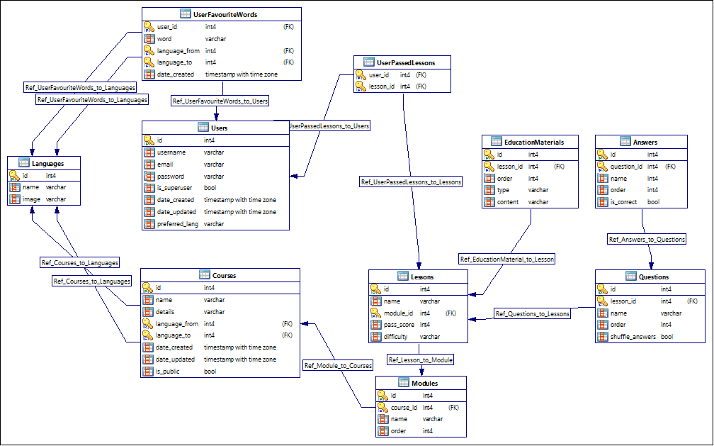

# База данных

В этом документе будет схема базы данных для проекта, а также пояснение к ней.

## О проекте

О проекте вы можете узнать в [этом документе](./diagrams.md)

## Навигация

1. [Схема базы данных](#схема-базы-данных)
2. [Сущности](#сущности)

## Схема базы данных

На изображении ниже вы можете увидеть схему БД приложения. В качестве базы данных будет использоваться PostgreSQL.

## Сущности

В этой главе будут подробно расписаны все таблицы схемы.

> Я не буду затрагивать колонку id (если она есть), поскольку в каждой таблице она будет иметь тип данных int, а также являтся первичным ключом.

### Users

**Описание:** Данная сущность представляет собой пользователя приложения.

#### Атрибуты

-   **username:** Тип данных: **varchar**, значение: имя пользователя
-   **email:** Тип данных: **varchar**, значение: эл. почта
-   **password:** Тип данных: **varchar**, значение: пароль
-   **is_superuser:** Тип данных: **bool**, значение: является ли администратором
-   **date_created:** Тип данных: **timestamp with timezone**, значение: дата создания
-   **date_updated:** Тип данных: **timestamp with timezone**, значение: дата изменения
-   **preferred_lang:** Тип данных: **varchar**, значение: предпочтительный язык

#### Связи

-   С таблицей **UserFavouriteWords**: Связь по колонке id **(User)** к user_id **(UserFavouriteWords)**

-   С таблицей **UserPassedLessons**: Связь по колонке id **(User)** к user_id **(UserPassedLessons)**

### Courses

**Описание:** Данная сущность представляет собой курс.

#### Атрибуты

-   **name:** Тип данных: **varchar**, значение: название
-   **details:** Тип данных: **varchar**, значение: описание
-   **language_from:** Тип данных: **int**, значение: язык **с** которого идет обучение (например: пользователь обучается с **русского** на язык **Х**)
-   **language_to:** Тип данных: **int**, значение: язык **на** который идет обучение (например: пользователь обучается с языка **Х** на **Английский**)
-   **date_created:** Тип данных: **timestamp with timezone**, значение: дата создания
-   **date_updated:** Тип данных: **timestamp with timezone**, значение: дата изменения
-   **is_public:** Тип данных: **bool**, значение: доступ к тесту **всем** пользователям

#### Связи

-   С таблицей **Languages**: Связь по колонке language_from и language_to **(Courses)** к id **(Languages)**

-   С таблицей **Modules**: Связь по колонке id **(Courses)** к course_id **(Modules)**

### Languages

**Описание:** Данная сущность представляет собой поддерживаемый язык.

#### Атрибуты

-   **name:** Тип данных: **varchar**, значение: название
-   **image:** Тип данных: **varchar**, значение: путь до изображения значка

#### Связи

-   С таблицей **UserFavouriteWords**: Связь по колонке id **(Languages)** к language_from и language_to **(UserFavouriteWords)**

-   С таблицей **Courses**: Связь по колонке id **(Languages)** к language_from и language_to **(Courses)**

### UserFavouriteWords

**Описание:** Данная сущность представляет собой слова, добавленные пользователем в избранное.

#### Атрибуты

-   **word:** Тип данных: **varchar**, значение: слово
-   **language_from:** Тип данных: **int**, значение: язык **с** которого идет обучение (например: пользователь обучается с **русского** на язык **Х**)
-   **language_to:** Тип данных: **int**, значение: язык **на** который идет обучение (например: пользователь обучается с языка **Х** на **Английский**)
-   **date_created:** Тип данных: **timestamp with timezone**, значение: дата создания

#### Связи

-   С таблицей **Users**: Связь по колонке id **(User)** к user_id **(UserFavouriteWords)**

-   С таблицей **Languages**: Связь по колонке id **(Languages)** к language_from и language_to **(UserFavouriteWords)**

### Lessons

**Описание:** Данная сущность представляет собой занятие модуля.

#### Атрибуты

-   **name:** Тип данных: **varchar**, значение: название
-   **module_id:** Тип данных: **int**, значение: модуль
-   **pass_score:** Тип данных: **int**, значение: балл для успешного прохождения
-   **difficulty:** Тип данных: **varchar**, значение: сложность

#### Связи

-   С таблицей **UserPassedLessons**: Связь по колонке id **(Lessons)** к lesson_id **(UserPassedLessons)**

-   С таблицей **Questions**: Связь по колонке id **(Lessons)** к lesson_id **(Questions)**

-   С таблицей **EducationMaterials**: Связь по колонке id **(Lessons)** к lesson_id **(EducationMaterials)**

### UserPassedLessons

**Описание:** Промежуточная таблица для отслеживания успешно пройденных пользователем занятий

#### Атрибуты

-   **user_id:** Тип данных: **int**, значение: пользователь
-   **lesson_id:** Тип данных: **int**, значение: занятие

#### Связи

-   С таблицей **Users**: Связь по колонке id **(Users)** к user_id **(UserPassedLessons)**

-   С таблицей **Lessons**: Связь по колонке id **(Lessons)** к lesson_id **(UserPassedLessons)**

### Modules

**Описание:** Данная сущность представляет собой модуль курса.

#### Атрибуты

-   **course_id:** Тип данных: **int**, значение: курс
-   **name:** Тип данных: **varchar**, значение: название
-   **order:** Тип данных: **int**, значение: порядок

#### Связи

-   С таблицей **Courses**: Связь по колонке id **(Courses)** к course_id **(Modules)**

-   С таблицей **Lessons**: Связь по колонке id **(Modules)** к course_id **(Lessons)**

### EducationMaterials

**Описание:** Данная сущность представляет собой обучающие материалы занятия.

#### Атрибуты

-   **lesson_id:** Тип данных: **int**, значение: занятие
-   **order:** Тип данных: **int**, значение: порядок
-   **type:** Тип данных: **varchar**, значение: тип
-   **content:** Тип данных: **int**, значение: контент материала

#### Связи

-   С таблицей **Lessons**: Связь по колонке id **(Lessons)** к lesson_id **(Lessons)**

### Questions

**Описание:** Данная сущность представляет собой вопрос по теме занятия.

#### Атрибуты

-   **lesson_id:** Тип данных: **int**, значение: занятие
-   **name:** Тип данных: **varchar**, значение: содержимое вопроса
-   **order:** Тип данных: **int**, значение: порядок
-   **shuffle_answers:** Тип данных: **bool**, значение: перемешивать ли ответы

#### Связи

-   С таблицей **Answers**: Связь по колонке id **(Questions)** к question_id **(Answers)**

-   С таблицей **Lessons**: Связь по колонке id **(Lessons)** к lesson_id **(Questions)**

### Answers

**Описание:** Данная сущность представляет собой ответ на вопрос.

#### Атрибуты

-   **question_id:** Тип данных: **int**, значение: вопрос
-   **name:** Тип данных: **varchar**, значение: текст ответа
-   **order:** Тип данных: **int**, значение: порядок
-   **is_correct:** Тип данных: **bool**, значение: верный ли ответ

#### Связи

-   С таблицей **Questions**: Связь по колонке id **(Questions)** к question_id **(Answers)**

## Заключение

Спасибо за прочтение. Надеюсь у вас не возникло вопросов почему была выбранна именно такая структура БД. Если у вас есть предложение по улучшению, можете открыть Issue в этом репозитории.
