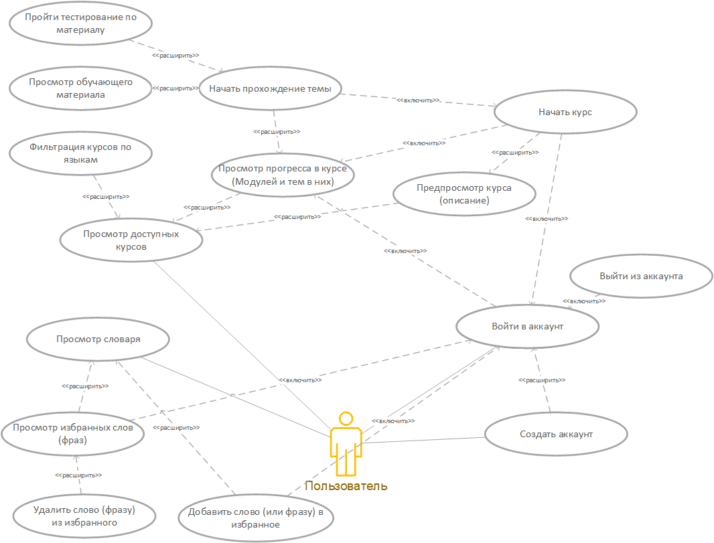
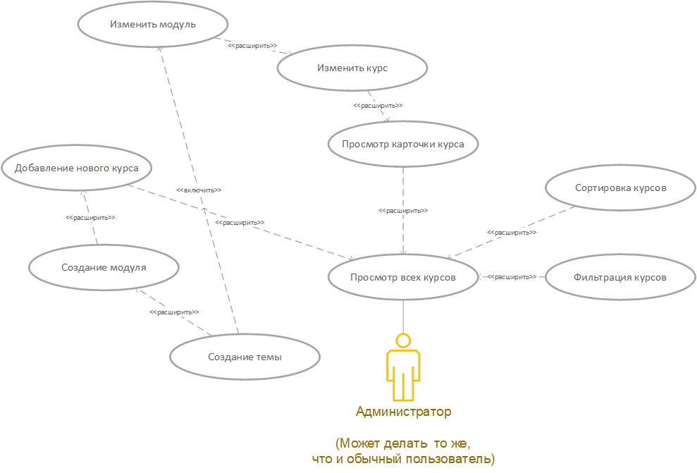

# Диаграммы

Здесь представлены основные диаграмы, по которым строится логика приложения. В качестве нотации была выбрана UML.

## О проекте

Этот проект выступает в качестве пет-проекта, в котором использованы интересующие меня технологий. По сути он представляется из себя подобие известного Duolingo, только в более упрощенном формате. В приложение будет возможность проходить различный обучающий материал в виде тестов, с возможностью выбора языка пользователя (с какого языка он учится) и таргетного языка (какой язык пользователь хочет выучить). Курсы и входящие в них модули могут быть созданы\изменены исключительно администратором.

## Навигация по диаграммам

1. [Use-Case (прецеденты)](#use-case)
2. [Sequence (последовательность)](#sequence)
3. [Activity (активности)](#activity)
4. [State (состояния)](#state)
5. [Classes (классы)](#classes)

Небольшое примечание: под изображением каждой диаграммы будет представлено небольшое пояснение.

### Use Case

<!-- для пользователя -->

> Пояснение: На этой диаграмме представлены сценарии использования приложения обычным пользователем. Действия, где стрелки подписаны "расширить" - действия которые доступны внутри элемента, к котором она идет. Если "включить", то действие требует другого действия, но не обязательно следует за ним.

<!-- для админа -->

> Пояснение: Здесь рассматриваются сценарии использования пользователя с админ-правами. Админ также может пользоваться приложением как и обычный пользователь. Администратор не может блокировать \ удалять других пользователей, поскольку их взаимодействие внутри приложения не предусмотрено. Также он не может повлиять на словарь, поскольку для его реализации будет использовано стороннее API.

[К навигации](#навигация-по-диаграммам)

### Sequence

> Пояснение:

[К навигации](#навигация-по-диаграммам)

### Activity

> Пояснение:

[К навигации](#навигация-по-диаграммам)

### State

> Пояснение:

[К навигации](#навигация-по-диаграммам)

### Classes

> Пояснение:

[К навигации](#навигация-по-диаграммам)
